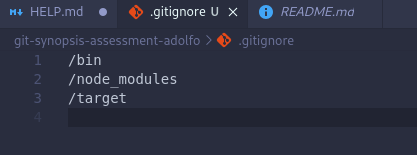
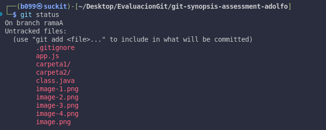
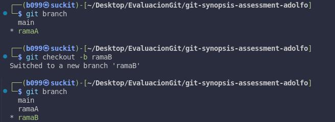
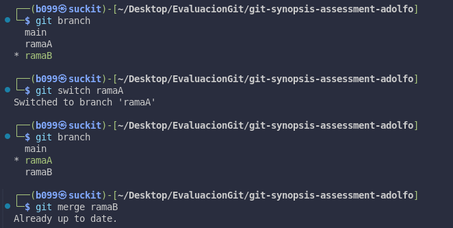
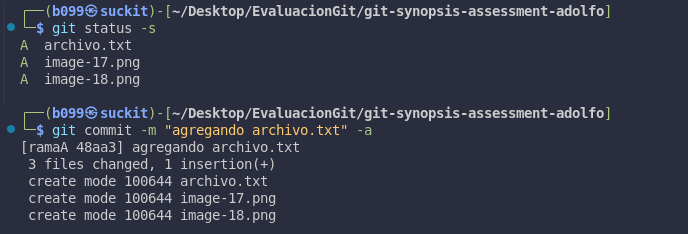

# Solución

## Actividad 1

1. Genere una **nueva rama A** en base a **main** y agregar los ficheros que considere necesarios. *(.js | .ts | .java | .cs | .html | etc)*.

2. Restringir del historial de cambios a las carpetas **/bin** **/node_modules** y **/target**.

3. Generar 2 carpetas cualquiera sin contenido que sean incluidas en el historial de cambios.

4. Generar **otra rama B** para realizar nuevas modificaciones y luego integrar estos en la **rama A**.

5. Integrar **SOLO** el commit con nombre *"FIX: issue 2"* de la rama **hotfix/main** en la **rama A**.

6. Ejemplifique el uso de git para la modificación de ficheros en la rama A y en la rama B simultaneamente **sin generar commits en el historial de cambios**.
    
    

7. Ejemplifique el uso de git para la generación y publicación de un **nuevo release (versión)** de su código.
    
    
    
## Extras

1. Ejemplique el uso de git para devolver un fichero del **staging area** al estado anterior.

2. Ejemplifique el uso de git para regresar en el tiempo hacia un **commit anterior en la rama A** de su repositorio remoto propio.

